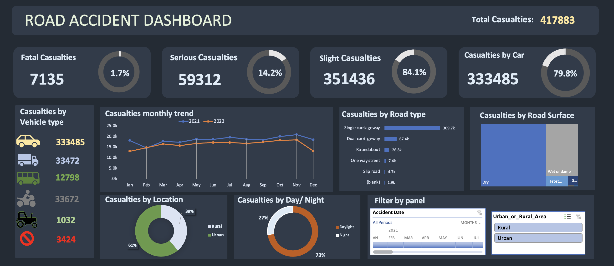

# Road-Accidents-in-India-Excel
## In this project I have analysed and created dashboard about road accidents in India. I have downloaded the data from kaggle.
## This is the screenshot of Dashboard

### 1 I have calculated total number of casualties occured by accidents.
### 2 I have created a pie chart where it shows severity of casualties and luckily percentage of fatal casualties are low
### 3 Next I have created the monthly trend of casualties to have an understanding if there is a specific month that is higher than others but as it'shown in the dashboard number of casualties in every months are similar to each other 
### 4 Another thing I was curious about was road types where accidents have accured, there was an interesting result more than 75% accidents occur on Single carriageway
### 5 In analyse of vehicle types more than 75% of accidents occur by car
### 6 Lastly I was curious if accidents occur on day time or night time and surprisingly 73% of accidents occur on a daytime
### Conclusion most of accidents occur by car I think tests for getting drive license should be more challening and drivers should be more trained.Plus while I was analysing road types I came to conclusion that Single carriage way roads  condition should be improved to prevent happening accidents and casualties 
